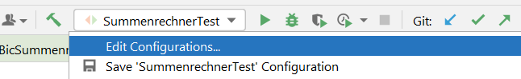
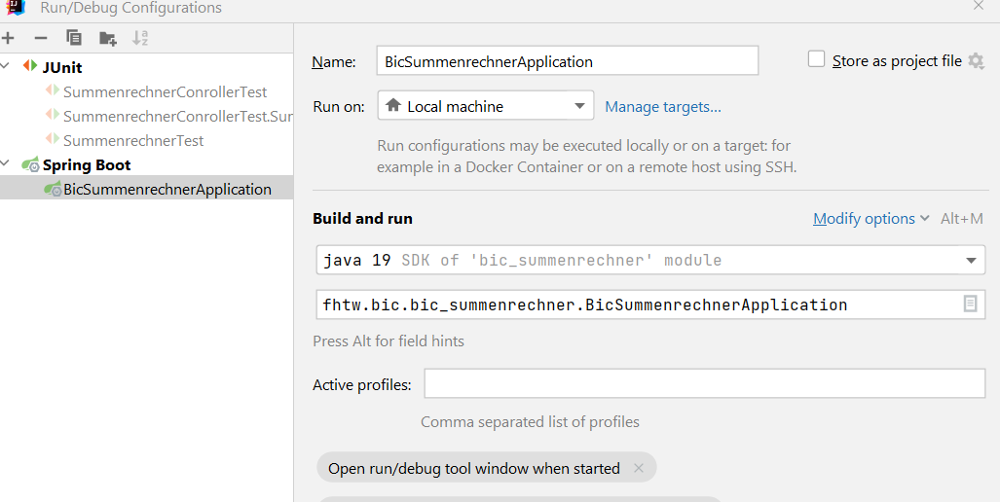
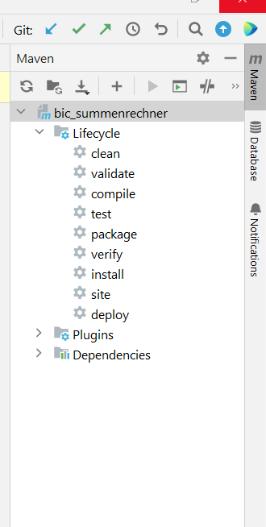
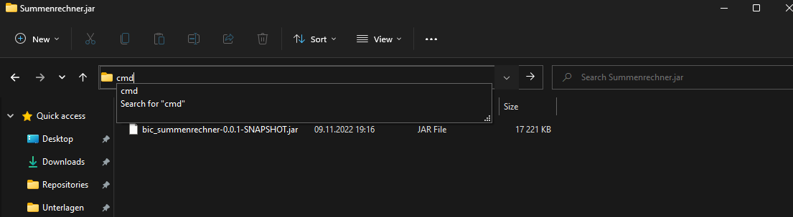

# bic_summenrechner

## 1 Anlegen des Projektes  
### 1.1  Neu in IntelliJ erstellen  
1.1.1 Neues Projekt anlegen  
1.1.2 Auswahl Spring Boot und einstellen der gewünschten Parameter (Java Version, JDK, etc.)  
1.1.3 Hinzufügen der gewünschten Dependencies (z.B. Spring Boot Web)  
1.1.4 Weiter klicken, etwaige Meldungen akzeptieren und das Project builden und ausführen

#### 1.2 In IntelliJ importieren  
1.2.1 Neues Prokt von existierenden Quellen erstellen  
1.2.2 Richtiges Buildtool auswählen (in unserem Fall Maven)  
1.2.3 Projekt importieren, Meldungen akzeptieren  
1.2.4 Neuen "Run/Debug" Schritt hinzufügen  
   
1.2.5  Spring Boot Konfiguration hinzufügen  
1.2.5.1 Richtige Java Version einstellen  
1.2.5.2 Klasse mit der main Methode auswählen
  
1.2.6 Speichern und die Konfiguration mit dem grünen Pfeil starten  
1.2.7 Spring Boot Application sollte jetzt starten

### 1.3 Projekt mittels Spring Initilizr erstellen 
1.3.1 Projekt mit gewünschten Eigenschaften und Abhängigen via [Spring Initilizr](https://start.spring.io/) erstellen und herunterladen    
1.3.2 Wie in [Abschnitt 1.2](#1.2 In IntelliJ importieren) beschrieben ein neues Projekt aus den Source Files erstellen

## 2 Summenrechner Klasse erstellen
2.0.1 Im src Ordner eine neue Klasse für den Summenrechner erstellen  
2.0.2 Klasse implementieren

### 2.1 Tests hinzufügen
2.1.1 Im test Ordner eine neue Klasse für die Summenrechnertest erstellen
2.1.2 Tests hinzufügen

[Tipps zur Namenskonvetion von Testfällen](https://medium.com/@stefanovskyi/unit-test-naming-conventions-dd9208eadbea)  
[Tests mehrmal mit verschiedenen Parametern durchführen](https://www.baeldung.com/parameterized-tests-junit-5)

### 2.2 Tests ausführen
2.2.1 Maven Menü öffnen  
2.2.2 Doppelklick auf test unter Lifecycle

## 3.1 SummenrechnerController Klasse erstellen
3.1.1 Im src Ordner eine neue Klasse erstellen  
3.1.2 Klasse implementieren

### 3.2 Tests hinzufügen
3.2.1 Im test Ordner eine neue Klasse erstellen  
3.2.2 Tests implementieren  
3.2.3 Tests ausführen

## 4 API via Insomnia testen
Um APIs lokal zu testen gibt es diverse Programme, die dazu dienen können.
Das bekannteste ist wohl [Postman](https://www.postman.com).
Im Rahmen der Lehrveranstaltung wurde [Insomnia](https://insomnia.rest/) verwendet. 

Bitte verwendet in der Zukunft ein Tool, dass euren Anforderungen gerecht wird. Es hat alles seine Vor- und Nachteile.

4.1 Spring Boot Project starten  
4.2 Schnittstelle mithilfe des Programms testen

## 5 Projekt auf Github pushen

### 5.1 Upstream Reposity einstellen
``` SHELL
git remote add origin UrlZumGitubRepository.git

git push -u -f origin main
```

### 5.2 Mergen Feature -> Development -> Release -> Main

5.2.1 Letzte Änderungen auf dem Feature Branch committen
``` SHELL
git commit -m "Finished basic summenrechner feature" 
```
Siehe [Tipps fuer commit Messages](https://cbea.ms/git-commit/)

5.2.2  Den Feature auf den development branch mergen
``` SHELL
git checkout development
```
5.2.3 Einen Release Branch erstellen
``` SHELL
git checkout -b release/basic_summenrechner
```

5.2.4 Auf Main Branch mergen
``` SHELL
git checkout main

git merge release/basic_summenrechner
```

5.2.5 Release taggen
``` SHELL
git tag -a v1.0.0 -m "bic_summenrechner v1.0.0"
```
5.2.6 Änderungen pushen

``` SHELL
git push origin

git push origin --tags
```
## 6 Java Version nachträglich ändern

Um die Java SDK Version nachträglich zu ändern müssen folgende Schritte durchgeführt werden:
1. Unter File - Project Structure (Ctrl+Alt+Shif+S) eine andere JDK Version auswählen, die bereits heruntergeladen ist,
oder über das Plus Symbol eine neue SDK hinzufügen/herunterladen.
2. Im pom.xml File im root Verzeichnis des Projektes folgenden xml Einträge verändern
```xml
<properties>
        <java.version>11</java.version> //Die Major Nummer z.B. 9,11, etc. hier eintragen und die Datei speichern
    </properties>
```
3. In den Run/Debug Configurations (Obere Zeile in IntelliJ mit dem PlayButton, etc.) ebenfalls die zu benutzende JDK
Version bei den einzelnen Configurations anpassen.

-------

4. Über die Maven Integration in IntelliJ einmal den Lifecylce Step "clean" ausführen und danach "compile".

5. Im Idealfall hat der Versionswechsel funktioniert und das Programm kann wieder ausgeführt werden. Wenn nicht, muss
der spezfischen Fehlermeldung, mit der Suchmaschine der Wahl, weiter verfolgt werden.

# 7 Ausführen der .jar Datei
Um die .jar Datei, die via Github Actions erstellt wird lokal ausführen zu können, sind folgende Schritte nötig.
1. Java Runtime muss auf dem Zielsystem installiert sein (In der JDK ist die JRE dabei, also sollte es auf euren )
Notebooks kein Problem geben. Überprüfen könnt ihr es, in dem ihr in einer Kommandozeile java --version eingebt
und eine Versionsnummer als Antwort bekommt)
2. Die Datei von Github herunterladen und das .zip entpacken
3. Eine Kommandozeile öffnen, die den Pfad zur Datei bereits geöffnet hat. (Tip: Wenn im Fileexplorer der entsprechende
Ordner geöffnet ist, kann man in die Pfadzeile einfach "cmd" schreiben, und ein Command Prompt erscheint mit dem
aktuellen Pfad)

4. Folgenden Befehl ausführen
``` 
java -jar Datei.jar
```
5. Danach sollte der Start der Applikation in der Kommandozeile nachvollziehbar sein. Wenn die Applikation gestartet ist,
kann die Schnittstelle über den Browser, ein API-Testing Tool, etc. aufgerufen werden.
